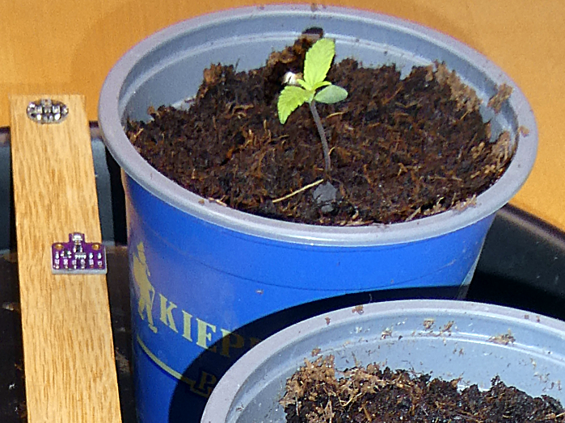
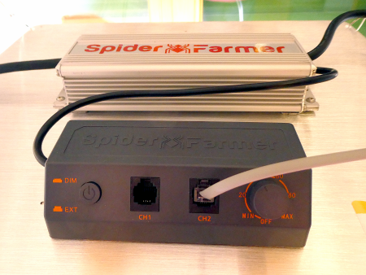
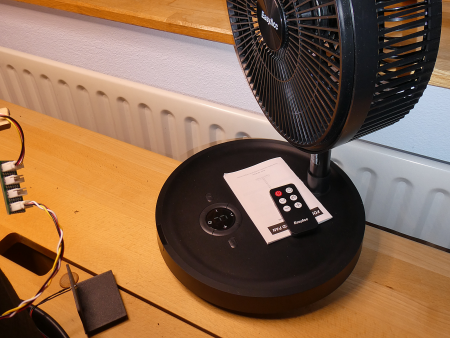

# Growing station: Control the light and the fan

## Some infos

It's spring and it's time to grow my little organic plants for the garden. This will happen indoors, but this year there is not much light from outside, so I decided to buy an LED Grow Light [SF2000Pro from Spider Farmer](https://www.spider-farmer.com/products/spider-farmer-sf2000pro-led-grow-light/). This panel is efficient and can be controlled from outside. For the beginning I added an environmental sensor (Bosch BME680) to measure temperature, humidity, (pressure) and gas, and three light sensors TSL2561 to ensure the light in lux.

After this I added a fan to avoid the temperature to rise to high under the LED.

## All infos on: <http://www.weigu.lu/microcontroller/growing_station/index.html>

